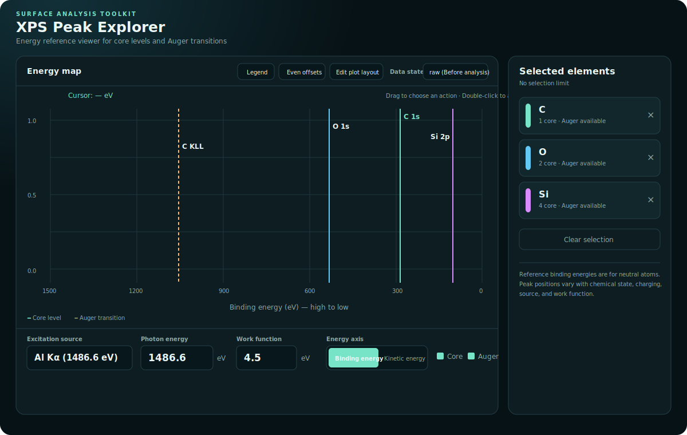
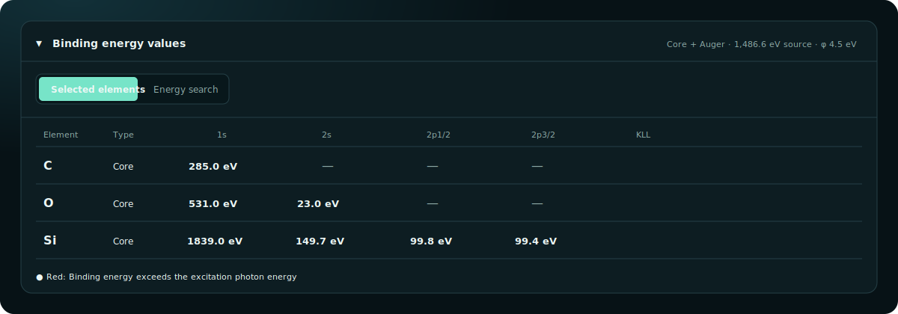
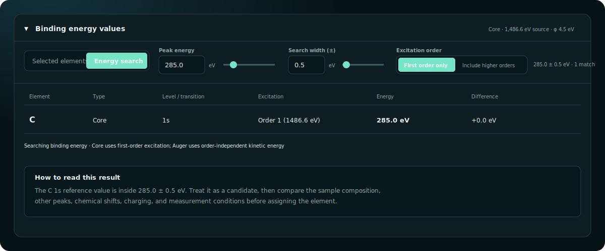
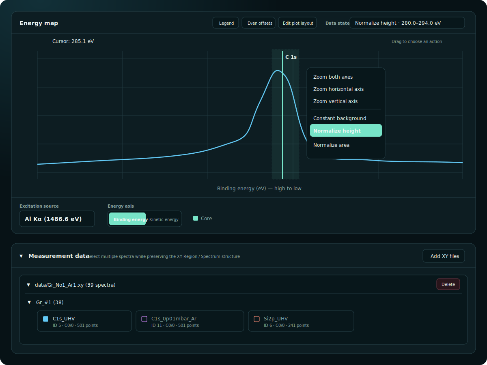

# CoreLevel - XPS Peak Explorer

XPS Peak Explorer is a browser app for inspecting X-ray photoelectron spectroscopy (XPS) and related measurements by **visualizing element binding energies and Auger electron energies**.

The basic workflow is to select elements from the periodic table at the bottom of the screen, compare expected peak positions in the plot at the top, and inspect exact values in the energy table. You can also search for candidate elements from a measured peak energy. XY measurement files can be overlaid on the reference peaks, with simple background subtraction and normalization tools available in the browser.

The app includes neutral-atom core levels and Auger transitions from H to U. It supports Al K-alpha, Mg K-alpha, and custom excitation photon energies. Neutral-atom binding energies are based on the LBNL X-Ray Data Booklet (XDB). Auger kinetic energies prefer recommended elemental reference data from the NIST X-ray Photoelectron Spectroscopy Database (SRD 20), supplemented by XDB Principal Auger Electron Energies where representative lines are not covered.

## Online URL

<https://corelevel-explorer.vercel.app/>

## Running Locally

No build step or package installation is required. Start a local HTTP server from the repository root:

```bash
python3 -m http.server 8000
```

Open <http://localhost:8000> in your browser. To stop the server, press `Ctrl+C` in the terminal where it is running.

> [!NOTE]
> You can open `index.html` directly, but using a local HTTP server is recommended to avoid browser security restrictions.

## Basic Usage

### 1. Select Elements and Visualize Reference Peaks

Use the `Periodic table` at the bottom of the screen to select elements that may be present in the sample. Selected elements are highlighted, added to `Selected elements`, and shown as vertical reference lines in the `Energy map`.



- `Core` displays binding energies, and `Auger` displays Auger transitions. Both can be shown at the same time.
- Switch the horizontal axis between `Binding energy` and `Kinetic energy`.
- Click a selected element card to temporarily hide it, use `x` to remove it, or use `Clear selection` to clear all selected elements.
- Choose the excitation source from `Al K-alpha`, `Mg K-alpha`, or `Custom`, then adjust `Photon energy` and `Work function` if needed.

### 2. Inspect Exact Energy Values

Open `Selected elements` in `Peak energies` to see the energy values for each selected element and level. The `Core` / `Auger` selection and energy-axis mode are shared between the plot and the table.



Values shown in red exceed the current excitation photon energy and are therefore not observable under that source. These are reference values, so measured peaks may not match them exactly.

### 3. Search Candidate Elements from a Peak Energy

If a peak is unknown, switch the table to `Energy search`. Enter the measured value in `Peak energy` and the allowed window in `Search width (+/-)`. The table lists matching elements, levels, and energy differences.



Use `Include higher orders` when you want to include peaks excited by higher-order photons. Candidate assignment should also consider sample composition, other observed peaks, and measurement conditions.

### 4. Overlay Measurement Data

Use `Add XY files` in `Measurement data` to add one or more local XY files. Check the regions you want to display, and the selected spectra will be overlaid on the `Energy map`.



Drag across the plot to open actions for the selected energy range:

- `Zoom both axes` / `Zoom horizontal axis` / `Zoom vertical axis`: zoom the selected range
- `Constant background`: subtract a constant background
- `Normalize height`: normalize by the maximum intensity in the selected range
- `Normalize area`: normalize by the integrated area in the selected range

Analysis results are saved as new states. Use `Data state` to switch between the original `raw` data and processed states. Double-click the plot to autoscale.

### Adjusting the Display

- `Edit plot layout`: edit line style, markers, color, offsets, and plot order
- `Even offsets`: apply evenly spaced offsets to multiple spectra
- `Legend`: show the legend, drag it to reposition it, and double-click items to edit names and font sizes

## Saving Data and Resetting

Loaded measurement data, selected elements, analysis results, and plot settings are automatically saved to IndexedDB in the browser and restored the next time you open the app in the same browser.

Saved state is separated by origin, so local development, Vercel Preview URLs, and the production URL do not share the same workspace. `Reset all` in the upper-right corner deletes the saved workspace and returns the app to its initial state.

Added XY files are read in the browser and stored in IndexedDB. This app does not upload measurement data to the application server.

## XY File Format

The app reads text files containing comment headers and two-column `energy counts/s` data. A single file can contain multiple `Region` sections.

```text
# Group: Sample 1
# Region: C 1s
# Spectrum ID: 1
# Excitation Energy: 1486.6
# Cycle: 1, Curve: 1
# ColumnLabels: energy counts/s
1200.0 1532.4
1199.9 1540.8
```

## Notes and Disclaimer

- Reference binding energies are neutral-atom values. Actual peak positions can shift with chemical state, charging, excitation source, calibration, and work function.
- Core levels above the current excitation photon energy are not shown in the plot.
- Do not use this app alone for definitive elemental or chemical-state identification. Compare results with calibrated measurements, standards, and literature values.

## Privacy

Measurement files are processed in your browser and saved locally in IndexedDB. The app does not upload XY files or generated analysis data to the application server.

The public site uses Vercel Analytics for aggregate page usage metrics. File contents and locally saved measurement data are not sent by the app as analytics events.

## Project Structure

- `index.html`: application entry point
- `assets/css/`: styles
- `assets/js/`: application logic and binding-energy data
- `docs/images/`: documentation images
- `vercel.json`: minimal static-site configuration for Vercel

## Repository

<https://github.com/ISSP-Matsuda-lab/XPS-Explorer>

## License

This project is published under the [MIT License](LICENSE).
